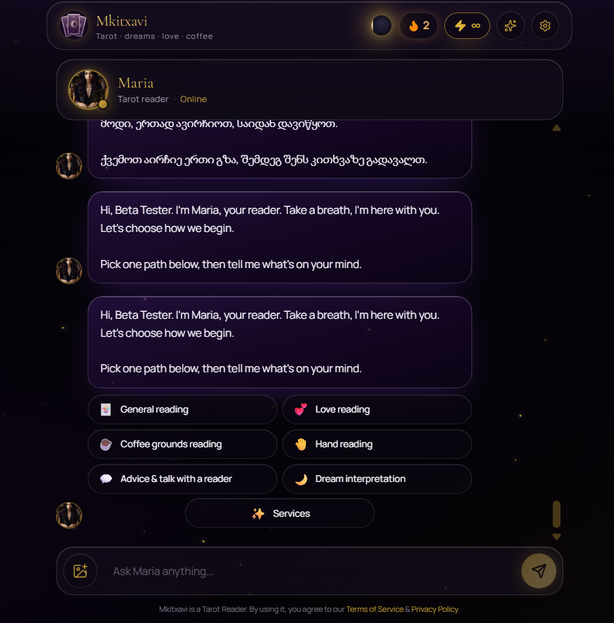

# Mkitxavi Tarot App

Mkitxavi is a tarot and astrology app in Georgian and English. Chat with Maria, explore 78 tarot cards, compare zodiac signs, and save your readings. Maria is an AI character; readings are for entertainment and reflection.

This is the source release of a retired project. Running a copy requires your own services and credentials. Production accounts and private backups are not part of the repository.

## A personal note

When I made this, I was a stupid young teenager with big ambitions for this project.

## Run locally

You need a recent Node.js release, Bun, and your own Supabase project.

1. Run `bun install`.
2. Copy `.env.example` to `.env` and fill in your Supabase URL, public key, and server service key.
3. Apply the SQL files in `supabase/migrations` in filename order. They record the development history, including superseded settings; review them before using them on an existing database.
4. Set `GEMINI_API_KEY` to enable Maria's responses.
5. Run `bun run dev` and open the local address printed in the terminal.

Set Supabase's authentication site URL and allowed callback URLs for your deployment. Google and Facebook login require your own OAuth apps. Read maintenance scripts before running them, especially scripts that change remote services.

## Services

Supabase stores accounts, profiles, energy, chats, readings, and console records. Uploaded avatars use the `avatars` bucket. Gemini supplies AI responses.

Resend handles mail when configured. Support alerts can fall back to FormSubmit. Supabase Auth sends confirmation and password-reset emails separately through its configured mail service.

Whop, Flitt, Creem, and Stripe integrations are included. Configure your own products and webhooks before enabling purchases. Ads also require your own advertising account.

The staff console requires `OPS_CONSOLE_GATE` and a staff account with appropriate permissions. A hidden URL alone does not provide access control. No staff accounts are seeded. Generate a bcrypt password hash locally and insert your initial owner into `ops_staff_users` using your own service credentials; then manage staff through the console.

## Daily energy

Energy is claimed when a user opens or returns to the app. It tops the wallet up to the daily allowance and does not accumulate while someone is away. The console shows the stored balance, which can remain zero until the next claim.

## Checks

Run `bun run typecheck`, `bun run lint`, and `bun run build`. After building, `bun run audit:secrets` compares the browser bundle with server-only values in your local `.env`. It supplements source review and does not prove every possible credential is absent.

## License

Original code is available under MIT. Dependencies and third-party assets retain their own rights; see [THIRD_PARTY_NOTICES.md](THIRD_PARTY_NOTICES.md).
